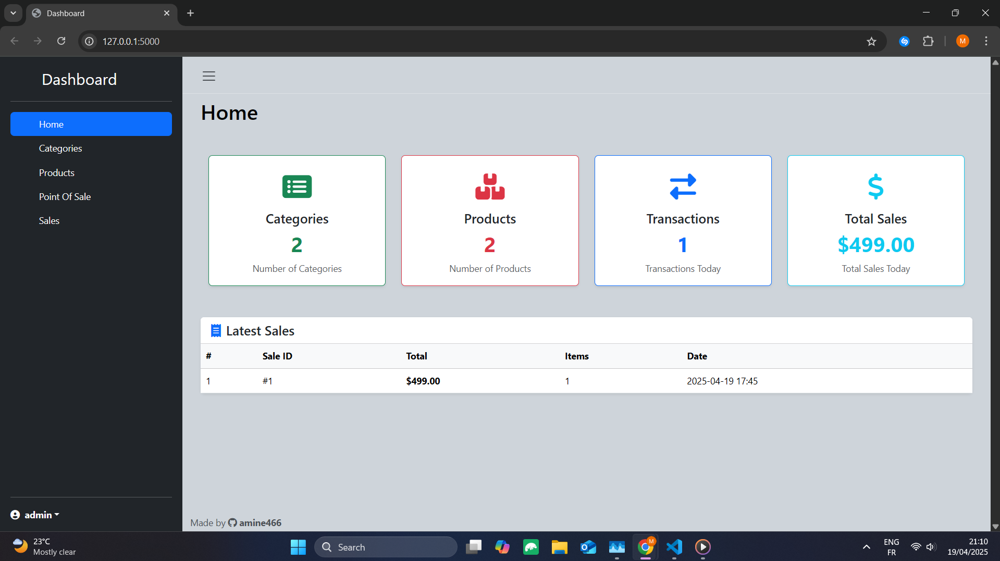
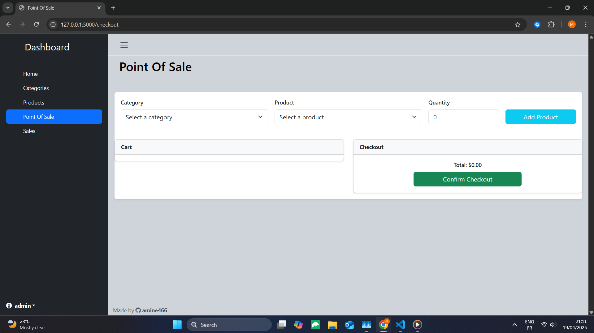

# Flask Inventory POS

A simple web-based Inventory and Point of Sale (POS) system built with Flask and Bootstrap.

## Features

- Category-based product filtering
- Add to cart and remove from cart
- Dynamic total calculation
- Checkout system with backend integration
- Responsive Bootstrap layout

## Technologies Used

- Python 3
- Flask
- Bootstrap 5
- JavaScript
- HTML/CSS

## Setup Instructions

1. Clone the repository:

```bash
git clone https://github.com/amine466/Flask-Inventory-POS.git
cd Flask-Inventory-POS
```

2. Create a virtual environment and activate it:

```bash
python -m venv venv
venv\Scripts\activate   # On Windows
```

3. Install dependencies:

```bash
pip install -r requirements.txt
```

4. Run the app:

```bash
python app.py
```

## Screenshots

### Dashboard View



### Point Of Sale View



## License

This project is licensed under the MIT License.